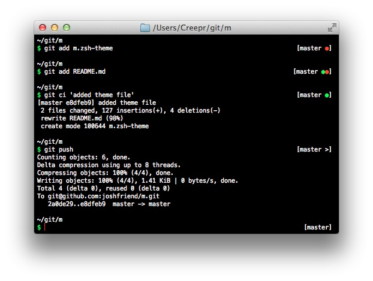

# M

**M** is for **Minimalism** - A simple theme for `zsh`

## Features

* Shows working dir
* Shows `$` for user prompt and `#` for root prompt
* Shows `git` status
    - Current branch
    - Ahead/Behind state
    - Working copy state (staged/unstaged/clean/unmerged/stashed)

## Requirements

* `zsh`
* [oh-my-zsh](https://github.com/robbyrussell/oh-my-zsh)

## Installation

Create a symlink to the theme file:

    $ ln -s path/to/m.zsh-theme ~/.oh-my-zsh/themes

And change your chosen theme in your `.zshrc` file:

    ZSH_THEME="m"
